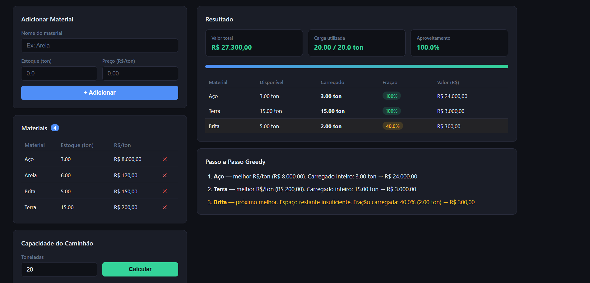
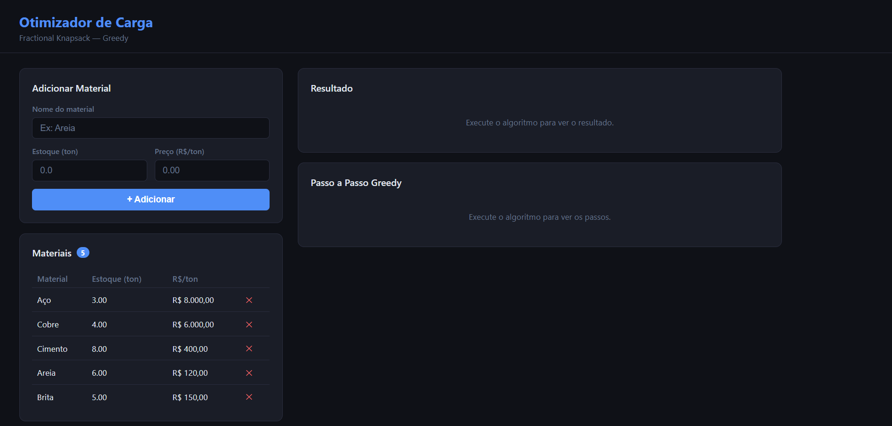
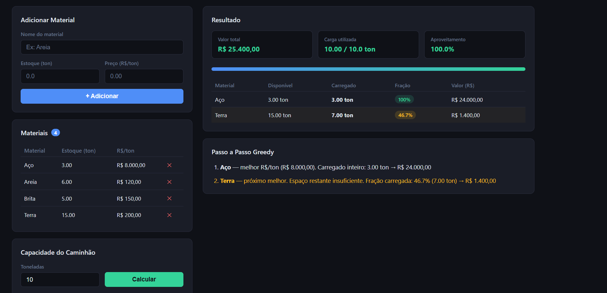

# Otimizador De Carga

Número da Lista: **G48**

Conteúdo da Disciplina: **Greedy**

## Alunos

| Matrícula  | Aluno                    |
| ---------- | ------------------------ |
| 23/1034082 | ARTUR HANDOW KRAUSPENHAR |
| 21/1031593 | ANDRE LOPES DE SOUSA     |

## Sobre

Implementação do algoritmo **Fractional Knapsack (Mochila Fracionária)** aplicado ao problema de otimização de carga em distribuidoras de materiais de construção, com interface web interativa.

**Problema:** Um caminhão possui capacidade limitada (em toneladas). A distribuidora tem diferentes materiais a granel em estoque, cada um com preço por tonelada distinto. O objetivo é selecionar quais materiais e em quais quantidades carregar para **maximizar o valor total da carga**.

**Por que Fractional Knapsack?** Materiais a granel (areia, cimento, brita, aço, cobre) são fisicamente divisíveis — é possível carregar exatamente 3.7 toneladas de cimento, por exemplo. Isso torna a versão fracionária aplicável e o algoritmo greedy ótimo.

**Algoritmo Greedy:**

1. Calcular o preço por tonelada de cada material
2. Ordenar os materiais em ordem decrescente de preço/ton
3. Pegar cada material por completo enquanto couber no caminhão
4. Se o próximo material não couber inteiro, pegar a fração que preenche o espaço restante

**Complexidade:** O(n log n) — dominado pela ordenação.

## Screenshots







## Instalação

Linguagem: **Python 3.x**
Framework: **Flask**

Pré-requisitos:

- Python 3.8 ou superior

```bash
git clone https://github.com/projeto-de-algoritmos-2026/Greedy_Otimizador-de-Carga.git
cd Greedy_Otimizador-de-Carga
pip install flask
```

## Uso

```bash
python app.py
```

Acesse `http://localhost:5000` no navegador.

**Funcionalidades da interface:**

- Adicionar materiais com nome, estoque (ton) e preço (R$/ton)
- Remover materiais da lista
- Definir capacidade do caminhão
- Visualizar resultado com valor total, peso utilizado e aproveitamento
- Barra de progresso da capacidade
- Tabela de carga selecionada indicando itens inteiros e fracionados
- Passo a passo do algoritmo greedy

## Outros

**Estrutura do Projeto:**

```
├── app.py          — servidor Flask e rotas
├── knapsack.py     — algoritmo Fractional Knapsack
├── templates/
│   └── index.html  — interface web
└── static/
    └── style.css   — estilos
```

O algoritmo em `knapsack.py` recebe:

- `capacity`: capacidade total em toneladas
- `materials`: lista de dicionários com `name`, `stock` e `price_per_ton`

Retorna os itens selecionados com quantidade, fração utilizada e valor, além do valor total da carga.

py` recebe:


- `capacity`: capacidade total em toneladas
- `materials`: lista de dicionários com `name`, `stock` e `price_per_ton`

Retorna os itens selecionados com quantidade, fração utilizada e valor, além do valor total da carga.
